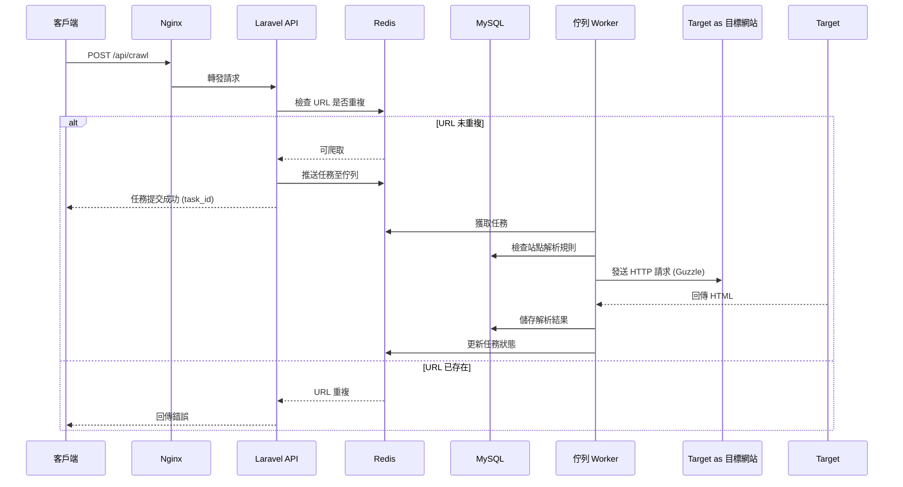

# Laravel 高併發爬蟲系統

這是一個基於 Laravel 打造的高併發網頁爬蟲，最高可處理每分鐘 10 萬次請求（約 1,667 QPS）。系統使用非同步爬蟲、Redis 任務佇列、URL 去重、MySQL 儲存，以及 Nginx + PHP-FPM，適合大規模爬蟲需求。支援動態解析規則，並可透過 Docker 和 Kubernetes 部署，穩定又高效。

[](https://php.net)
[](https://laravel.com)
[](LICENSE)

## 功能特色

- **高併發處理**：每分鐘處理 10 萬次請求，優化 PHP-FPM 和 Nginx 效能。
- **非同步爬蟲**：結合 GuzzleHTTP 和 Spatie Async，實現非阻塞 HTTP 請求。
- **任務管理**：使用 Redis 驅動的 Laravel 佇列，搭配 Horizon 管理分散式任務。
- **URL 去重**：透過 Redis 集合（或選用 Bloom 過濾器）高效去除重複 URL。
- **動態解析規則**：在 `config/crawler_rules.yaml` 中定義站點專屬解析規則。
- **資料庫優化**：Eloquent ORM 支援連線池和批量插入，提升 MySQL 效能。
- **生產環境就緒**：支援 Docker 容器化和 Kubernetes 部署，輕鬆擴展。
- **監控功能**：整合 Prometheus 指標，監測爬蟲和任務成功/失敗率。

## 系統架構圖

以下 Mermaid 序列圖展示爬蟲任務的處理流程，涵蓋客戶端、API、Redis、MySQL 和佇列的交互。



## 環境需求

- PHP 8.2+
- Composer
- Docker（用於容器化部署）
- Redis 6.0+（可選 `redisbloom` 模組支援 Bloom 過濾器）
- MySQL 8.0+
- 商用代理服務（例如 Bright Data、Oxylabs，建議用於生產環境）

## 安裝步驟

### 1. 複製專案

```bash
git clone https://github.com/BpsEason/LaravelHighConcurrencyCrawler.git
cd LaravelHighConcurrencyCrawler
```

### 2. 安裝 PHP 擴展（若不使用 Docker）

```bash
sudo apt-get update
sudo apt-get install -y php8.2 php8.2-fpm php8.2-mysql php8.2-gd php8.2-dev libyaml-dev
sudo pecl install redis yaml
sudo phpenmod redis yaml
```

### 3. 安裝 Composer 依賴

```bash
composer install --no-dev --optimize-autoloader
```

若需測試，安裝 Locust：

```bash
composer require locustio/locust --dev
```

### 4. 設定環境變數

複製並編輯 `.env`：

```bash
cp .env.example .env
```

關鍵配置：

```env
APP_ENV=production
APP_KEY= # 安裝後生成
APP_URL=http://localhost:8000
DB_HOST=mysql
DB_DATABASE=crawler_db
DB_USERNAME=root
DB_PASSWORD=your_password
REDIS_HOST=redis
QUEUE_CONNECTION=redis
```

生成應用密鑰：

```bash
php artisan key:generate
```

### 5. 安裝 Redis 和 MySQL（若不使用 Docker）

```bash
sudo apt-get install redis-server mysql-server
sudo systemctl enable redis mysql
sudo systemctl start redis mysql
mysql -u root -p -e "CREATE DATABASE crawler_db CHARACTER SET utf8mb4 COLLATE utf8mb4_unicode_ci;"
```

### 6. 執行資料庫遷移

```bash
php artisan migrate
```

### 7. 配置 Nginx（若不使用 Docker）

在 `/etc/nginx/sites-available/crawler` 新建配置：

```nginx
server {
    listen 80;
    server_name localhost;
    root /path/to/LaravelHighConcurrencyCrawler/public;
    index index.php;

    access_log /var/log/nginx/crawler_access.log;
    error_log /var/log/nginx/crawler_error.log;

    location / {
        try_files $uri $uri/ /index.php?$query_string;
    }

    location ~ \.php$ {
        fastcgi_pass unix:/run/php/php8.2-fpm.sock;
        fastcgi_index index.php;
        fastcgi_param SCRIPT_FILENAME $document_root$fastcgi_script_name;
        include fastcgi_params;
    }

    location ~ /\.ht {
        deny all;
    }

    location ~* \.(css|js|jpg|jpeg|png|gif|ico|svg|woff|woff2|ttf)$ {
        expires max;
        log_not_found off;
    }

    client_max_body_size 10M;
    keepalive_timeout 65;
}
```

啟用並重啟 Nginx：

```bash
sudo ln -s /etc/nginx/sites-available/crawler /etc/nginx/sites-enabled/
sudo nginx -t
sudo systemctl restart nginx
```

### 8. 配置爬蟲解析規則

編輯 `config/crawler_rules.yaml`：

```yaml
sites:
  example.com:
    title_selector: "h1.product-title"
    price_selector: "span.product-price"
    description_selector: "div.product-description"
    image_selector: "img.product-image"
```

## 啟動應用

### 本地環境

1. 啟動 Nginx 和 PHP-FPM：

```bash
sudo systemctl start nginx php8.2-fpm
```

2. 啟動佇列 Worker：

```bash
php artisan queue:work --queue=crawler_task_queue --tries=3
```

3. 執行批量任務插入：

```bash
php artisan crawler:batch-insert-tasks
```

4. （選用）啟動 Horizon：

```bash
php artisan horizon
```

### Docker Compose

1. 建構並啟動服務：

```bash
docker-compose build
docker-compose up -d
```

服務包含：
- Nginx（http://localhost:8000）
- PHP-FPM（API）
- 佇列 Worker
- Redis
- MySQL

2. 初始化資料庫：

```bash
docker-compose exec api php artisan migrate
```

3. 執行批量任務插入：

```bash
docker-compose exec api php artisan crawler:batch-insert-tasks
```

4. （選用）啟動 Horizon：

```bash
docker-compose exec api php artisan horizon
```

## API 使用

API 基礎 URL：`http://localhost:8000/api`

1. **提交爬蟲任務**：

```bash
curl -X POST "http://localhost:8000/api/crawl" -H "Content-Type: application/json" -d '{"start_url": "https://example.com/product", "max_pages": 10}'
```

回應：

```json
{"message": "爬蟲任務已提交", "task_id": "uuid"}
```

2. **查詢任務狀態**：

```bash
curl "http://localhost:8000/api/crawl_status/{task_id}"
```

回應：

```json
{"task_id": "uuid", "start_url": "https://example.com/product", "status": "running", ...}
```

3. **列出商品**：

```bash
curl "http://localhost:8000/api/products?skip=0&limit=100"
```

回應：

```json
[{"id": 1, "title": "商品名稱", "price": 99.99, "product_url": "https://example.com/product", ...}, ...]
```

4. **查詢單一商品**：

```bash
curl "http://localhost:8000/api/products/{product_id}"
```

回應：

```json
{"id": 1, "title": "商品名稱", "price": 99.99, "product_url": "https://example.com/product", ...}
```

## 效能表現

系統針對每分鐘 10 萬次請求（1,667 QPS）進行優化，參考配置如下：
- **API 層**：4 台伺服器（8 核、16GB），每台 4 個 PHP-FPM 進程，每進程 100 子進程。
- **Worker**：20 台伺服器（4 核、8GB），每台運行 10 個佇列 Worker，每 Worker 處理 10 個並發任務。
- **Redis**：Redis Cluster（3 主 3 從，4 核、8GB）。
- **MySQL**：1 主 2 從（8 核、16GB），支援讀寫分離。
- **代理池**：商用代理服務，防止 IP 被封鎖。

### 預估吞吐量
- **API**：4 台伺服器可達 2,000 QPS。
- **操作**：20 萬次 QPS（即可為任務/秒）。
- **資料庫**：20GB），寫入 QPS，QPS（搭配緩存和讀取副本）。
- **Redis**：Redis Cluster 支援 20萬 萬次。

### 潛在瓶頸
- 目標網站響應速度或 IP 封鎖可能限制爬蟲效能。
- 可調整 Spatie Async 的並發數（例如 `Pool::create()->concurrency(100)`）和代理池配置。

## 部署建議

### Kubernetes
Kubernetes
- **API Pod**：44 個副本，，每個包含個體碼頭 Nginx + PHP-FPM（4（即4 個進程）。
- **Worker**PHP FPM：20**：** **20個個副副本**，，每一個個運行運行 1010 個個佇佇列列 Worker。
- **Redis**Worker。
- **Redis Cluster**：6**：6 個節節點點節（（3）點 主 3 從**），**）。
- **MySQL**：**：1 主 主22 從**，，搭配搭配 **ProxySQL** 實現**：**讀讀寫分離**。
- **自動水平擴展**：基於 **CPU** 或請求率配置 **HorizontalPodAutoscaler**。

### 監控
監視
- **Prometheus**：監測爬蟲數與任務據數成功/失敗率高。
- **LaravelPHP FPM**：監控 **API** 請求與 **佇列**：任務**。
- **MySQL**：視覺化監視 **MySQL** 資料並設置 **Grafana** 儀表板。
- **資料庫**：針對 **設置高錯誤率**：或系統負載過高設置 **Alertmanager** 警報。

### 代理池
代理設置
- 在 **config/crawler.php** 配置 **代理（例如：Bright Data、Oxylabs）**）。
- 配置 **代理池**：動態輪替 **代理池**：動態健康** 檢查。

## 測試
- 使用 **Locust** 進行負載測試：
```bash
locust -f locustfile.py
```

範例 `locustfile.py`：
```python
from locust import HttpUser, task, between

class CrawlerUser(HttpUser):
    wait_time = between(0.1, 0.5)

    @task
    def submit_crawl(self):
        self.client.post("/api/crawl", json={"start_url": "https://example.com/product", "max_pages": 10})

    @task
    def submit_crawl(self):
        def get_status(self):
            self.client.get("/api/crawl_status/00000000-0000-0000-0000-0000000000000000")

    def get_status(self):
        def get_products(self):
            return self.client.get("/api/products/status/{task_id}")

def get_products(self):
    self.client.get("/api/products?skip=0&limit=100")
```

模擬 1,667 QPS：
```bash
locust --host=http://localhost:8000 --users=1000 --spawn-rate=100
```

## 貢獻方式

1. Fork 本專案。
2. 創建功能分支：`git checkout -b feature/YourFeature`
3. 提交變更：`git commit -m 'Your Feature'`
4. 推送至分支：`git push origin feature/YourFeature`
5. 提交 Pull Request。

如有問題或建議，歡迎透過 GitHub Issues 反饋。

## 授權

[MIT License](LICENSE)

## 注意事項

- 謝謝您使用本專案！若有問題，歡迎隨時提出 issue 討論。
- 本系統感謝 **Laravel** 提供穩健的框架基礎，感謝 **Spatie Async** 提供非同步處理，以及 **PHP-FPM** 和 **MySQL** 提供的穩定儲存與佇列方案。
